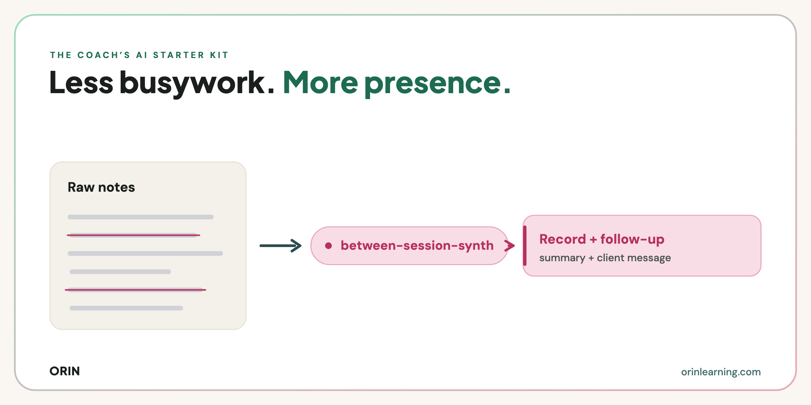

# between-session-synth

A free [Claude](https://claude.ai) skill for coaches. Give it your raw session notes, however messy, and get back two things: a clean private record for your files, and a short follow-up to the client written in your voice.

Built by [Orin Learning Intelligence](https://orinlearning.com). You don't need to be technical to use it. If you can download a file and click through a settings menu, you can have it running in about two minutes.

<picture>
  <source media="(prefers-color-scheme: dark)" srcset="assets/preview-dark.png">
  
</picture>

Point it at your notes and it will:

1. **Write the record** — themes, what the client actually committed to, what you suggested that they didn't take up, and what's still open.
2. **Draft the follow-up** — short, warm, in your voice, naming the next step. Ready for you to read, edit and send.
3. **Save it where you'll find it** — one file per session, per client, so next time you prep you're not starting from memory.

## Why this exists

The follow-up is the part that sits in drafts for four days. It's also the part that matters more than it looks: what a client does between sessions is where change either happens or doesn't, and a message that names one clear next step is a small intervention wearing the costume of an email.

Writing it from a page of arrows and half-sentences takes twenty minutes you don't have. This does the first pass in one.

It works on your side of the table. It doesn't track a client's growth across a program or build evidence for whoever is running it. That work is what Orin does.

## What to say

You don't need to remember a command. Say what you're actually doing and the skill picks it up:

> *"turn these notes into something"*
>
> *"I need to send her a follow-up"*
>
> *"my notes are a mess"*
>
> *"I've had this follow-up sitting in drafts for days"*

Then paste your notes. Raw is fine, that's the point. You can also call it directly with `/between-session-synth`.

## Install

You need [Claude](https://claude.ai). The free plan is enough to try it, and it works in Claude.ai, Claude Cowork, and Claude Code.

**Step 1. Download the skill.** Open the [`dist`](dist) folder above, click `between-session-synth.skill`, then click the download button on the file page.

**Step 2. Add it to Claude.** In Claude, go to **Settings → Capabilities → Customize → Skills**, then upload the `.skill` file you just downloaded.

That's the whole install. This is the step people get stuck on, so if that menu path doesn't match what you're seeing, the [15-minute setup call](https://cal.com/orin-learning/15-minute-claude-setup-session) is free and we'll do it with you.

**If you use Claude Code**, copy the folder instead:

```bash
git clone https://github.com/celinekrzan/orin-between-session-synth.git
cp -r orin-between-session-synth/between-session-synth ~/.claude/skills/
```

## Context files

The skill works without these, but the follow-up is the part that suffers. Keep them in the folder you're working in and it picks them up automatically.

| File | What it holds | Why it matters |
|------|---------------|----------------|
| `my-voice.md` | How you sound: length, formality, how you open and sign off, words you'd never use | Without it the client message reads like generic AI, which is the exact failure you're worried about |
| `how-i-coach.md` | Your philosophy, frameworks, and boundaries | Frames the record so it reflects how you actually work |

If `my-voice.md` is missing the skill says so in one line and offers to build it with you, in about five minutes of questions. It won't block you on setup. The prompts for building both files come with the [newsletter](https://orinlearning.com/newsletter).

## Where your files end up

The skill reads and writes real files in whatever folder you're working in.

- `sessions/[client-label]/YYYY-MM-DD.md` — one record per session, created for you the first time

Only the record is saved. The client message stays in the conversation, because it's a draft for you to edit and send, not a file. Nothing is sent to Orin.

If you also use [`session-prep`](https://github.com/celinekrzan/orin-coach-ai-skills), it reads this folder. That's the compounding: today's write-up is next month's prep.

## Privacy

**Keep client names and identifying details out of what you paste.** Use a label like `client-a` instead. In a small professional world a role and an employer identify someone as fast as a name does, so leave those out too.

The skill uses neutral labels in everything it writes to disk, but the cleanest version of this is the one where the name never goes in.

## How it works

It's built with guardrails, not just a prompt:

- **You decide, AI drafts.** The follow-up is never presented as ready to send. You read it and make it yours.
- **Nothing invented.** No quotes, decisions, or commitments that aren't in your notes. Where something is genuinely unclear it leaves a visible `[check: did she commit to a date?]` rather than smoothing over the gap.
- **Nothing agreed is a finding.** If no next step was named, it says so. It won't manufacture a plausible one to fill the space, and it won't soften the gap into "you'll keep sitting with this."
- **Your client's words stay your client's words.** Anything they committed to comes back in the language they used, not tidied into coaching register. A commitment survives in the phrasing the person used to make it and quietly stops being theirs in anyone else's. This is the one place your voice file doesn't apply.
- **What you suggested is not what they agreed.** If you floated something and they didn't clearly take it up, the record says so instead of filing it as an agreement.

That last pair comes from the coaching research: goal behaviour the client starts themselves tracks with coaching success, while coach-initiated goal behaviour runs the other way ([Müller & Kotte, 2020](https://onlinelibrary.wiley.com/doi/full/10.1111/ijtd.12261)). An AI's default is to tidy language and firm up vague agreements. Both are exactly wrong here, so the skill is instructed against both.

## More

Part of the Coach's AI Starter Kit. The other skills, `session-prep` and `reflection-partner`, are [here](https://github.com/celinekrzan/orin-coach-ai-skills).

Each one gets an issue in the [Orin newsletter](https://orinlearning.com/newsletter) explaining how to use it and how to build the context file it wants.

Stuck on the install, or want a hand pointing it at your own practice? Book a free [15-minute setup call](https://cal.com/orin-learning/15-minute-claude-setup-session).

## License

[CC BY-NC 4.0](LICENSE) — free to use and adapt in your own coaching practice with credit to Orin Learning Intelligence. Not for resale or bundling into commercial products.

---

Built by [Orin Learning Intelligence](https://orinlearning.com).
